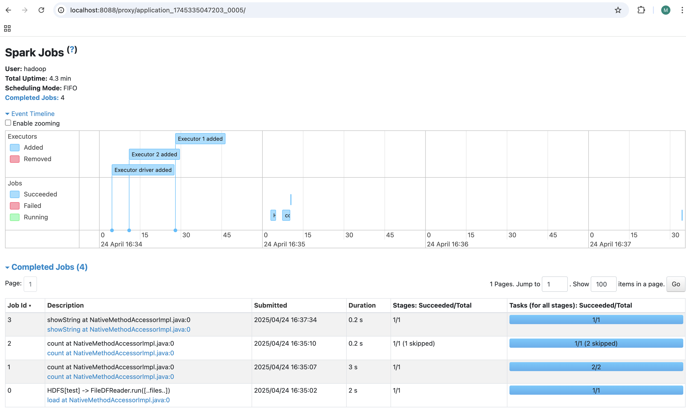
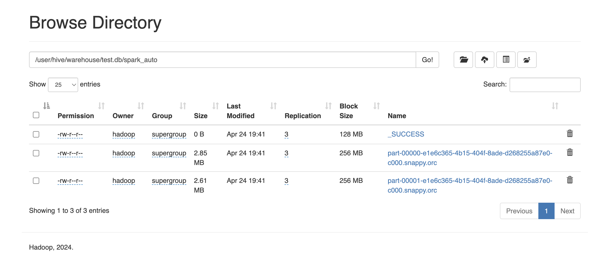
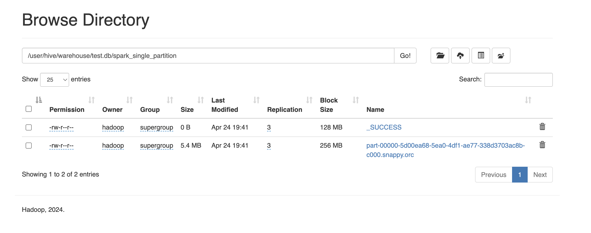
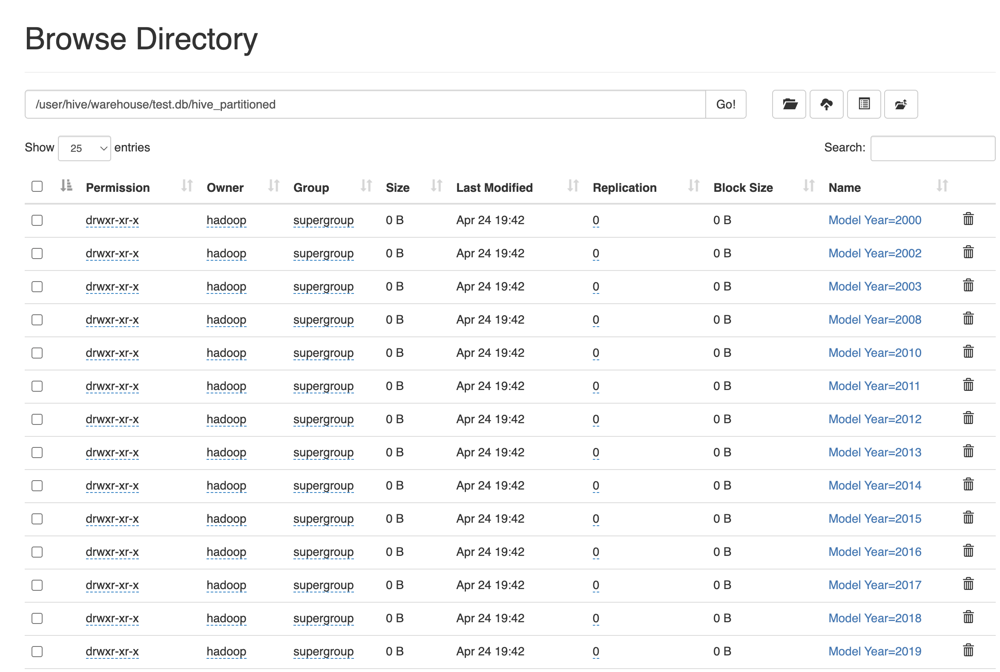
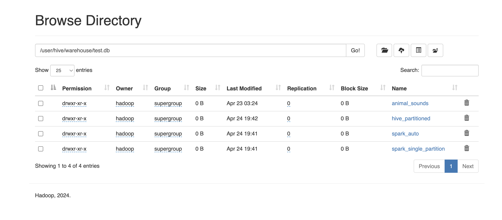

# 📘 HW4: Развертывание Apache Spark с YARN и интеграция с HDFS + Hive

## 📋 Описание задания

Реализация использования Apache Spark под управлением YARN на кластере, настроенном в предыдущих заданиях. Работа включает чтение, трансформацию и сохранение данных в Hive, с использованием партиционирования и возможностью чтения через Hive CLI.

---

## 🧰 Предварительные требования

- Ubuntu 24.04
- Python 3.12.3
- Java 11.0.26
- Развернутый кластер HDFS
- Развернутый Hive Metastore

---

## 🔐 Шаг 1. Подключение к главному узлу (Jump Node)

```bash
ssh -L 9870:127.0.0.1:9870 -L 8088:127.0.0.1:8088 -L 19888:127.0.0.1:19888 team@<JUMP-HOST-IP>
```

Замените `<JUMP-HOST-IP>` на IP-адрес вашей jump-ноды.

---

## ⚙️ Шаг 2. Установка и настройка окружения

### Установка зависимостей:

```bash
sudo apt update
sudo apt install python3-venv python3-pip
```

### Переход в пользователя Hadoop:

```bash
sudo -i -u hadoop
```

### Скачивание и установка Apache Spark:

```bash
wget https://archive.apache.org/dist/spark/spark-3.5.3/spark-3.5.3-bin-hadoop3.tgz
tar -xzvf spark-3.5.3-bin-hadoop3.tgz
```

---

## 🌍 Шаг 3. Настройка переменных окружения

```bash
export HADOOP_CONF_DIR="/home/hadoop/hadoop-3.4.0/etc/hadoop"
export HIVE_HOME="/home/hadoop/apache-hive-4.0.0-alpha-2-bin"
export HIVE_CONF_DIR=$HIVE_HOME/conf
export HIVE_AUX_JARS_PATH=$HIVE_HOME/lib/*
export PATH=$PATH:$HIVE_HOME/bin
export SPARK_LOCAL_IP=192.168.1.14 # Укажите IP вашей jump-ноды
export SPARK_DIST_CLASSPATH="/home/hadoop/spark-3.5.3-bin-hadoop3/jars/*:/home/hadoop/hadoop-3.4.0/etc/hadoop:/home/hadoop/hadoop-3.4.0/share/hadoop/common/lib/*:/home/hadoop/hadoop-3.4.0/share/hadoop/common/*:/home/hadoop/hadoop-3.4.0/share/hadoop/hdfs:/home/hadoop/hadoop-3.4.0/share/hadoop/hdfs/lib/*:/home/hadoop/hadoop-3.4.0/share/hadoop/hdfs/*:/home/hadoop/hadoop-3.4.0/share/hadoop/mapreduce/*:/home/hadoop/hadoop-3.4.0/share/hadoop/yarn:/home/hadoop/hadoop-3.4.0/share/hadoop/yarn/lib/*:/home/hadoop/hadoop-3.4.0/share/hadoop/yarn/*:/home/hadoop/apache-hive-4.0.0-alpha-2-bin/*:/home/hadoop/apache-hive-4.0.0-alpha-2-bin/lib/*"

cd spark-3.5.3-bin-hadoop3/
export SPARK_HOME=`pwd`
export PYTHONPATH=$(ZIPS=("$SPARK_HOME"/python/lib/*.zip); IFS=:; echo "${ZIPS[*]}"):$PYTHONPATH
export PATH=$SPARK_HOME/bin:$PATH
```

---

## 🧪 Шаг 4. Подготовка Python окружения

```bash
cd ~
python3 -m venv venv
source venv/bin/activate

pip install -U pip
pip install ipython
pip install onetl[files]
```

---

## 📂 Шаг 5. Подготовка данных в HDFS

```bash
hdfs dfs -mkdir -p /input
wget https://raw.githubusercontent.com/MesserMMP/Datasets/main/Electric_Vehicle_Population_Data.csv -O electric_vehicles.csv
hdfs dfs -put electric_vehicles.csv /input
```

---

## 🚀 Шаг 6. Запуск Spark-сессии с Hive и YARN

Перед тем как запускать Spark-сессию с Hive, необходимо запустить Hive Metastore вручную в фоне (если он ещё не запущен):

```bash
hive --hiveconf hive.server2.enable.doAs=false \
     --hiveconf hive.security.authorization.enabled=false \
     --service metastore 1>> /tmp/metastore.log 2>> /tmp/metastore.log &
```

Запустите интерактивную оболочку Python:
```bash
ipython
```

### 📦 Чтение данных и подключение к HDFS:

```python
from pyspark.sql import SparkSession, functions as F
from onetl.connection import SparkHDFS, Hive
from onetl.file import FileDFReader
from onetl.file.format import CSV
from onetl.db import DBWriter

spark = SparkSession.builder \
    .master("yarn") \
    .appName("spark-with-yarn") \
    .config("spark.sql.warehouse.dir", "/user/hive/warehouse") \
    .config("spark.hive.metastore.uris", "thrift://tmpl-jn:9083") \
    .enableHiveSupport() \
    .getOrCreate()

hdfs = SparkHDFS(host="tmpl-nn", port=9000, spark=spark, cluster="test")
reader = FileDFReader(connection=hdfs, format=CSV(delimiter=",", header=True), source_path="/input")
df = reader.run(["electric_vehicles.csv"])
df.count() # Общее число строк
df.rdd.getNumPartitions() # Число партиций (2)
dt = df.select("Model Year") # Столбец для партиционирования Hive
dt.show()
```
*Результат работы из веб интерфейса:*



---

## 🔁 Шаг 7. Применение нескольких трансформаций (агрегации и преобразования типов)

Приведите некоторые числовые столбцы к нужным типам, а затем выполните агрегацию:

```python
from pyspark.sql.types import IntegerType, DoubleType

# Преобразование типов
df_transformed = df \
    .withColumn("Model Year", F.col("Model Year").cast(IntegerType())) \
    .withColumn("Electric Range", F.col("Electric Range").cast(IntegerType())) \
    .withColumn("Base MSRP", F.col("Base MSRP").cast(DoubleType()))

# Пример агрегации: средний запас хода по каждому году
df_agg = df_transformed.groupBy("Model Year").agg(
    F.count("*").alias("vehicle_count"),
    F.avg("Electric Range").alias("avg_range"),
    F.avg("Base MSRP").alias("avg_msrp")
)

df_agg.orderBy("Model Year").show()
```

Эти преобразования позволяют использовать Spark как полноценный аналитический инструмент для обобщения и анализа EV-дата.

---

## 📝 Шаг 8. Запись данных в Hive тремя способами

### ✅ Способ 1. Автоматическая запись через Spark без явного указания партиций

Создаём таблицу `test.spark_auto`:

```python
hive = Hive(spark=spark, cluster="test")
hive.check()  # Проверка подключения

writer = DBWriter(
    connection=hive,
    table="test.spark_auto",
    options={"if_exists": "replace_entire_table"},
)
writer.run(df)
```

*Как видно из веб-интерфейса было создано 2 таблицы по числу партиций:*



---

### ✅ Способ 2. Объединение всех партиций Spark в одну (coalesce)

Создаём таблицу `test.spark_single_partition`:

```python
df_single_partition = df.coalesce(1)

writer = DBWriter(
    connection=hive,
    table="test.spark_single_partition",
    options={"if_exists": "replace_entire_table"},
)
writer.run(df_single_partition)
```

*Как видно из веб-интерфейса тут уже только 1 таблица:*



---

### ✅ Способ 3. Партиционирование через Hive по столбцу `Model Year`

Создаём таблицу `test.hive_partitioned`:

```python
writer = DBWriter(
    connection=hive,
    table="test.hive_partitioned",
    options={
        "if_exists": "replace_entire_table",
        "partitionBy": "Model Year",
    },
)
writer.run(df)
```

*Как видно из веб-интерфейса тут уже только таблицы для каждого значения года `Model Year`:*



*Все созданные таблицы:*




---

## 🔍 Шаг 9. Проверка результатов в Hive CLI


```bash
beeline -u jdbc:hive2://tmpl-jn:5432 -n scott -p tiger
```

```sql
USE test;
SHOW TABLES;
SELECT * FROM spark_auto LIMIT 5;
SELECT * FROM spark_single_partition LIMIT 5;
SELECT * FROM hive_partitioned LIMIT 5;
```

---

## ⛔ Шаг 10. Завершение сессии

```python
spark.stop()
```

---
