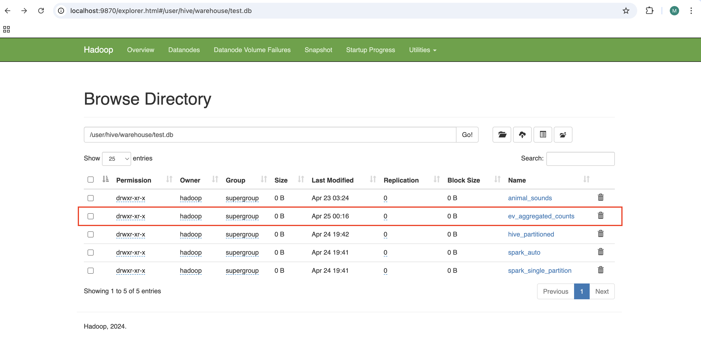
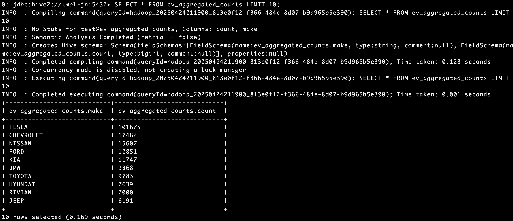

# 🚀 HW5: Data Processing Flow with Prefect + Apache Spark on YARN

Реализация потока данных с использованием [Prefect](https://docs.prefect.io/) и Apache Spark в кластере, развернутом ранее.

---

## 📦 0. Предустановки

Перед началом убедитесь, что в вашем окружении:

- Развёрнут кластер Hadoop с поддержкой YARN.
- Установлен и настроен Hive с внешним Metastore.
- Файл `electric_vehicles.csv` загружен в HDFS по пути `/input`.
- На главном узле установлен Python 3.12 и доступны утилиты `pip`, `venv`.
- Корректно указаны переменные окружения
---

## 🖥️ 1. Подключение к кластеру

Подключитесь к главному узлу и перейдите под пользователя `hadoop`.

```bash
ssh -L 9870:127.0.0.1:9870 -L 8088:127.0.0.1:8088 -L 19888:127.0.0.1:19888 team@<JUMP-HOST-IP>
sudo -i -u hadoop
```

> 🔁 Замените `<JUMP-HOST-IP>` на IP-адрес вашей jump-ноды.

---

## ⚙️ 2. Подготовка окружения Python

Создайте виртуальное окружение и установите `Prefect`:

```bash
cd ~
python3 -m venv venv
source venv/bin/activate
pip install prefect
```

---

## 🧾 3. Создание ETL-потока в `Prefect`

Создайте файл `etl_flow.py`:

```bash
vim etl_flow.py
```

Вставьте следующий код:

```python
from pyspark.sql import SparkSession, functions as F
from onetl.connection import SparkHDFS, Hive
from onetl.file import FileDFReader
from onetl.file.format import CSV
from onetl.db import DBWriter
from prefect import flow, task

@task
def get_spark():
    spark = SparkSession.builder \
        .master("yarn") \
        .appName("spark-with-yarn") \
        .config("spark.sql.warehouse.dir", "/user/hive/warehouse") \
        .config("spark.hive.metastore.uris", "thrift://tmpl-jn:9083") \
        .enableHiveSupport() \
        .getOrCreate()
    return spark

@task
def stop_spark(spark):
    spark.stop()

@task
def extract(spark):
    hdfs = SparkHDFS(host="tmpl-nn", port=9000, spark=spark, cluster="test")
    reader = FileDFReader(connection=hdfs, format=CSV(delimiter=",", header=True), source_path="/input")
    df = reader.run(["electric_vehicles.csv"])
    return df

@task
def transform(df):
    df_cleaned = df.withColumn("Model Year", F.col("Model Year").cast("int"))  # Преобразование типов
    df_agg = df_cleaned.groupBy("Make").count().orderBy("count", ascending=False)  # Агрегация
    return df_agg

@task
def load(spark, df):
    hive = Hive(spark=spark, cluster="test")
    writer = DBWriter(connection=hive, table="test.ev_aggregated_counts",
                      options={"if_exists": "replace_entire_table"})
    writer.run(df)

@flow
def process_data():
    spark = get_spark()
    df = extract(spark)
    df = transform(df)
    load(spark, df)
    stop_spark(spark)

if __name__ == "__main__":
    process_data()
```

---

## ▶️ 4. Запуск потока

```bash
python etl_flow.py
```

После успешного выполнения будет создана новая таблица `ev_aggregated_counts` в Hive.

🖼️ *Список всех таблиц из web-интерфейса:*



---

## 🔍 5. Проверка результатов через Hive CLI

Подключитесь к `Hive`:

```bash
beeline -u jdbc:hive2://tmpl-jn:5432 -n scott -p tiger
```

Выполните SQL-запрос:

```sql
USE test;
SHOW TABLES;
SELECT * FROM ev_aggregated_counts LIMIT 10;
```

🖼️ *Пример вывода:*



---

## ✅ Результат

- Данные были прочитаны из HDFS при помощи Spark.
- Выполнена трансформация данных:
  - Приведение типа столбца `Model Year` к `int`.
- Выполнена агрегация:
  - Подсчет количества автомобилей по бренду (`Make`).
  - Сортировка по убыванию количества.
- Результаты сохранены как таблица в Hive (`ev_aggregated_counts`).
- Весь процесс реализован в виде потока с использованием Prefect.

---
