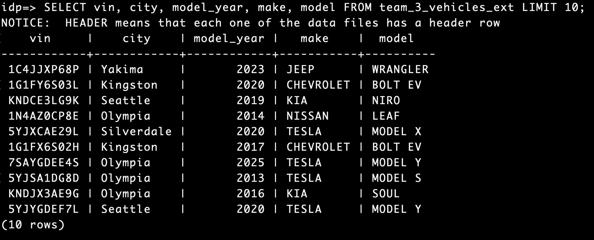

# ✅ Домашнее задание №6: Работа с Greenplum и gpfdist

## 📌 Цель

Загрузить CSV-файл в базу данных Greenplum (база `idp`) через внешнюю таблицу с использованием `gpfdist`.

---

## 1. 🔐 Подключение к удалённой машине

```bash
ssh user@91.185.85.179
```

Пароль: `4!4v$6IGP%kdVLYR`

---

## 2. 📁 Создание директории для данных

Создай папку с названием, соответствующим команде:

```bash
mkdir -p ~/team-3-data
```

---

## 3. 📂 Загрузка файла

Перенеси нужный CSV-файл (у меня это `electric_vehicles.csv`) с локальной машины на сервер с помощью `scp`:

```bash
scp electric_vehicles.csv user@91.185.85.179:/home/user/team-3-data/
```

---

## 4. 🧱 Запуск `gpfdist` в фоне с использованием `nohup`

Чтобы не блокировать терминал, запускаем процесс `gpfdist` в фоне с использованием команды `nohup`.

### 🚀 4.1 Запуск `gpfdist` в фоне:

```bash
nohup gpfdist -d /home/user/team-3-data -p 8086 > gpfdist.log 2>&1 &
```

- `nohup` позволяет запустить процесс в фоне, который продолжит работать даже после выхода из сессии.
- `gpfdist.log` — файл, в который записываются логи.
- `2>&1` перенаправляет стандартный вывод и ошибки в файл лога.
- `&` в конце запускает процесс в фоне.

Теперь процесс `gpfdist` будет работать в фоне, и ты сможешь продолжать выполнять другие команды в терминале.

---

## 5. 🧪 Подключение к базе Greenplum

```bash
source /usr/local/greenplum-db/greenplum_path.sh
psql -d idp
```

---

## 6. 🛠 Создание внешней таблицы

Внутри `psql` создай внешнюю таблицу, соответствующую структуре твоего файла. Пример:

```sql
DROP EXTERNAL TABLE IF EXISTS team_3_vehicles_ext;

CREATE EXTERNAL TABLE team_3_vehicles_ext (
  vin                        VARCHAR(11),
  county                     VARCHAR(50),
  city                       VARCHAR(50),
  state                      CHAR(2),
  postal_code                VARCHAR(10),
  model_year                 INTEGER,
  make                       VARCHAR(50),
  model                      VARCHAR(50),
  ev_type                    VARCHAR(100),
  cafv_eligibility           TEXT,
  electric_range             INTEGER,
  base_msrp                  INTEGER,
  legislative_district       SMALLINT,
  dol_vehicle_id             VARCHAR(30),
  vehicle_location           TEXT,
  electric_utility           TEXT,
  census_tract               VARCHAR(30)
)
LOCATION (
  'gpfdist://localhost:8086/electric_vehicles.csv'
)
FORMAT 'CSV' (
  HEADER
  DELIMITER ','
);
```

---

## 7. ✅ Проверка данных

```sql
SELECT vin, city, model_year, make, model FROM team_3_vehicles_ext LIMIT 10;
```

🖼️ *Результат запроса `SELECT` к таблице:*


---

## 📌 Примечание

- Чтобы проверить логи `gpfdist`, открой файл `gpfdist.log`:

  ```bash
  cat gpfdist.log
  ```
